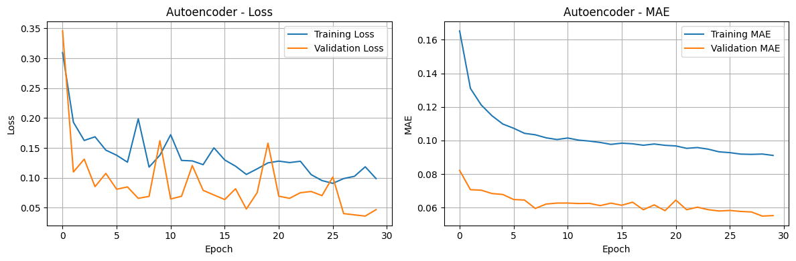

# 🌐 Network Intrusion Detection System (NIDS) Using Deep Learning

A complete and user-friendly implementation of a **Network Intrusion Detection System (NIDS)** built using deep learning, machine learning, and statistical feature analysis.  
This project walks you through the full pipeline—from **PCA-based preprocessing**, to **model training**, to **model deployment**—with pre-trained models ready for immediate use.

---

## 🧭 Introduction

Traditional rule-based intrusion detection systems often fail to recognize new or evolving cyber threats.  
This project implements a **modern deep-learning-driven NIDS pipeline** that combines:

- PCA-driven dimensionality reduction  
- Deep learning autoencoders for anomaly detection  
- Machine learning classifiers (e.g., scikit-learn, XGBoost)  
- Feature engineering and statistical selection methods  

This repository is suitable for students, researchers, and engineers working on intelligent intrusion detection and cybersecurity analytics.

---

## 📚 Dataset Information

This project uses the **Cleaned & Preprocessed CICIDS2017 Dataset**, created by **Eric Anacleto Ribeiro** and published on **Kaggle** under a **CC0: Public Domain license**.

### 📄 Dataset: <a href="https://www.kaggle.com/datasets/ericanacletoribeiro/cicids2017-cleaned-and-preprocessed">*Cleaned and Preprocessed CICIDS2017 Data for Machine Learning*</a>

**File Used:**
- `cicids2017_cleaned.csv` — A fully cleaned, merged, preprocessed version of CICIDS2017, containing raw but cleaned features ready for scaling and sampling after train/test split.

### 🧾 About the Original Dataset (CICIDS2017)

The original CICIDS2017 dataset captures both benign and malicious network traffic across multiple attack scenarios. While widely used, the raw files require heavy preprocessing for machine learning tasks.

### 🛠 Steps Performed by the Dataset Author

The cleaned version used in this project includes the following improvements:

#### **Data Cleaning & Integrity**
- Merged multiple CSV files into a unified dataset  
- Removed duplicate rows and duplicate columns  
- Replaced infinite values with NaN for consistency  
- Removed rows with missing values (<1% of dataset)

#### **Feature Engineering & Selection**
- Removed columns with only one unique value  
- Applied correlation analysis to remove highly correlated features (≥ 0.99)  
- Combined **Kruskal-Wallis H-test** with **Random Forest feature importance** to remove statistically irrelevant features  

#### **Label Refinement**
- Converted original `Label` column into a simplified `Attack Type` column  
- Grouped similar attack types (e.g., DoS Hulk + DoS GoldenEye → "DoS")  
- Removed extremely rare attack classes (e.g., Heartbleed, Infiltration) to avoid overfitting  

This cleaned dataset forms the **starting point** of the PCA and model training workflow in this project.

---
## 🔗 Dataset Download Links

You may download the dataset from the following locations.

**🔹 Cleaned & Preprocessed CICIDS2017 Dataset (Used for PCA Analysis)**  

👉 **Official Dataset Page (Kaggle):** [Dataset from kaggle](https://www.kaggle.com/datasets/ericanacletoribeiro/cicids2017-cleaned-and-preprocessed) 

👉 **Direct Download (google drive):** [Dataset from google drive](https://drive.google.com/file/d/1aZYqdwk5dT4kSOStpVfUykmEqE4Pyuvd/view?usp=drive_link)  

**🔹 Fully processed CICIDS2017 Dataset (Used for model training)**  

👉 **Direct Download (google drive):** [Dataset from google drive](https://drive.google.com/file/d/1J5-W5HCwSDLy8f25MjOYG_IlW06O7w7n/view?usp=drive_link)

---
## 🔄 Project Workflow

This NIDS pipeline follows a structured, three-stage workflow:

### `PCA Analysis  →  NIDS Training  →  NIDS Deployment`

### 1️⃣ PCA Analysis (`PCA_Analysis.py` / `PCA_Analysis.ipynb`)
- Performed on the **Cleaned & Preprocessed CICIDS2017 dataset**  
- Reduces dimensionality  
- Extracts high-value features  
- Generates variance and correlation reports  

### 2️⃣ NIDS Training (`NIDS_Training.py`)
- Uses PCA results + cleaned dataset  
- Trains multiple models (Autoencoder, XGBoost, scikit-learn models)  
- Saves models, encoders, scalers, thresholds, and metadata to `saved_models/`

### 3️⃣ NIDS Deployment (`NIDS_Deploy.py`)
- Loads all pre-trained components  
- Processes new samples  
- Performs real-time intrusion detection  

---

## 🚀 Features

- **Deep Learning Autoencoder** for anomaly detection  
- **XGBoost + ML Pipelines** for high-accuracy classification  
- **Complete PCA Workflow** for dimensionality reduction  
- **Ready-to-Use Deployment Script**  
- **Pretrained Models Included**  
- **Feature importance analysis**  
- **Interactive notebooks for exploration**  

---

## 📁 Project Structure

```
Network-Intrusion-Detection-System/
│
├── .gradio/                              # Gradio interface cache
│   └── certificate.pem                   # SSL certificate
│
│
├── img/                            # images
│   ├── dimensionality_reduction.png
│   ├── feature_importance.png
│   ├── MAE.png
│   └── web_deployment_result.png
│
├── notebooks/                            # Interactive analysis
│   ├── Network_Intrusion_Detection_System.ipynb
│   └── PCA_Analysis.ipynb
│
├── saved_models/                         # ALL PRE-TRAINED MODELS
│   ├── trained_nids_model.pkl           # Main scikit-learn model
│   ├── trained_nids_model_xgb.model     # XGBoost model
│   ├── trained_nids_model_autoencoder.h5 # TensorFlow autoencoder
│   ├── trained_nids_model_scaler.pkl    # Feature scaler
│   ├── trained_nids_model_label_encoder.pkl # Label encoder
│   ├── trained_nids_model_features.pkl  # Feature list
│   ├── trained_nids_model_metadata.pkl  # Training metadata
│   └── trained_nids_model_threshold.pkl # Anomaly threshold
│
├── feature_importance_results.csv        # Feature analysis
├── LICENSE                              # MIT License
├── NIDS_Deploy.py                       # DEPLOYMENT SCRIPT
├── NIDS_Training.py                     # TRAINING SCRIPT
├── PCA_Analysis.py                      # PCA analysis script
├── trained_nids_simple.pkl          # Lightweight model
├── README.md                            # This file
└── requirements.txt                     # Dependencies
```
---
## 🎯 Quick Start - Google Colab (Recommended for beginners)

### PCA Analysis
[](https://colab.research.google.com/drive/1wIKLTrIim4bxRCpWY_f4tBAuyi8w25Qe?usp=drive_link)
1. Click the Colab badge above
2. Run the cell
3. Results are displayed at the bottom

### NIDS Training and Deployment

[](https://colab.research.google.com/drive/14nXSV3Mxhx4xEF5ut9o2RFFh3ayRrUuX?usp=sharing)

1. Click the Colab badge above
2. Select Run all
3. Interact with the Gradio interface at the bottom
---
## ⚙️ Installation

### 1. Clone the repository
```
git clone https://github.com/ScriptedLines404/Network-Intrusion-Detection-System-using-Deep-Learning.git
cd Network-Intrusion-Detection-System-using-Deep-Learning
```
### 2. Create a virtual environment
```
python -m venv venv
source venv/bin/activate      # Linux/macOS
venv\Scripts\activate         # Windows
```
### 3. Install dependencies
```
pip install -r requirements.txt
```
---

## 🧰 Usage

### 📊 PCA Analysis
Perform PCA and feature analysis:
```
python PCA_Analysis.py
```
This step generates:
* PCA variance reports
* Feature correlation files
* leaned feature lists saved to saved_models/

### 🧠 Training the Model
Train all NIDS models:
```
python NIDS_Training.py
```
The script:

* Trains ML + DL models
* Saves all artifacts automatically
* Generates metadata for deployment

### 🛡️ Deploying the NIDS
To run classification or anomaly detection:
```
python NIDS_Deploy.py
```
Loads all pre-trained models and performs inference on new network samples.

### 📑 Pretrained Models
Located in:
```
saved_models/
```
Includes:

* Autoencoder
* XGBoost classifier
* Scikit-learn model
* Scaler, encoder, metadata, threshold, features

This enables instant model deployment without the need for retraining.

---

## 📊 PCA Analysis & Model Performance Results
### 🔍 Principal Component Analysis (PCA) Results
#### Dataset Overview
```
Dataset shape: (2,520,751 samples × 52 features)
Number of attack classes: 7
Target distribution:
• Normal Traffic:    2,095,057 samples (83.1%)
• DoS:                 193,745 samples (7.7%)
• DDoS:                128,014 samples (5.1%)
• Port Scanning:        90,694 samples (3.6%)
• Brute Force:           9,150 samples (0.4%)
• Web Attacks:           2,143 samples (0.08%)
• Bots:                  1,948 samples (0.08%)
```
#### Dimensionality Reduction


```
Optimal number of components to explain 95.0% variance: 20
Total variance explained by first 20 components: 0.9508
```
#### Top 20 Most Important Features for NIDS
| Rank | Feature                    | Importance Score |
|------|----------------------------|------------------|
| 1    | Min Packet Length          | 0.154774         |
| 2    | PSH Flag Count             | 0.150304         |
| 3    | Bwd Packet Length Min      | 0.144673         |
| 4    | Subflow Fwd Bytes          | 0.144076         |
| 5    | Total Length of Fwd Packets| 0.144001         |
| 6    | Bwd IAT Total              | 0.132763         |
| 7    | Bwd Packet Length Mean     | 0.129960         |
| 8    | Fwd Packet Length Mean     | 0.126202         |
| 9    | Destination Port           | 0.124723         |
| 10   | Active Max                 | 0.124153         |
| 11   | Fwd Packet Length Std      | 0.124147         |
| 12   | Average Packet Size        | 0.123569         |
| 13   | Fwd Packet Length Max      | 0.122527         |
| 14   | Bwd Packet Length Std      | 0.121820         |
| 15   | Packet Length Variance     | 0.121274         |
| 16   | Active Mean                | 0.120901         |
| 17   | Bwd Packet Length Max      | 0.120738         |
| 18   | Packet Length Mean         | 0.120551         |
| 19   | Packet Length Std          | 0.119923         |
| 20   | ACK Flag Count             | 0.119518         |

#### Classification Performance with PCA Components

```
Classification accuracy using PCA components: 0.9985 (99.85%)
```

#### Detailed Performance Metrics:

| Attack Type      | Precision | Recall | F1-Score | Support   |
|------------------|-----------|--------|----------|-----------|
| Bots             | 0.83      | 0.65   | 0.73     | 389       |
| Brute Force      | 1.00      | 1.00   | 1.00     | 1,830     |
| DDoS             | 1.00      | 1.00   | 1.00     | 25,603    |
| DoS              | 1.00      | 1.00   | 1.00     | 38,749    |
| Normal Traffic   | 1.00      | 1.00   | 1.00     | 419,012   |
| Port Scanning    | 0.99      | 0.99   | 0.99     | 18,139    |
| Web Attacks      | 0.99      | 0.97   | 0.98     | 429       |

#### Overall Statistics:

- **Macro Average:** 0.97 precision, 0.94 recall, 0.96 F1-score
- **Weighted Average:** 1.00 across all metrics
- **Total Test Samples:** 504,151

### 🤖 Model Training Results
#### XGBoost Model Performance


```
Accuracy: 0.9996 (99.96%)  
Precision: 0.9996  
Recall: 0.9996  
F1-Score: 0.9996  
```
**Breakdown:**
- Perfect detection of **DDoS, DoS, and normal traffic** (100% accuracy)
- High detection rates for **port scanning and web attacks** (>99%)
- Robust performance across all attack categories

#### Autoencoder Anomaly Detection

 **Model Architecture:**
- **Input dimension:** 20
- **Encoding dimension:** 10
- **Total parameters:** 7,518
- **Training epochs:** 30



**Final Training Results:**
- **Validation loss:** 0.0468
- **Validation MAE:** 0.0553

**Anomaly Detection:**
- **Threshold:** 0.1252 (95th percentile)
- **Anomalies detected:** 10,407 (4.96% of test set)

**Reconstruction Error Statistics:**
- **Mean:** 0.0360
- **Std:** 0.8902
- **Max:** 227.9218

### Training Efficiency

#### Autoencoder Training:
- **Time per epoch:** 16–22 seconds
- **Total training time:** ~9 minutes
- **Model size:** 29.37 KB

#### XGBoost Training:
- Efficient gradient boosting
- Fast convergence
- Lightweight model
---
## 🚀 Deployment Results
### Web Interface Deployment


### System Capabilities

1. Real-time Processing: < 100ms inference time per sample
2. Multi-model Ensemble: Combines XGBoost and Autoencoder
3. Comprehensive Detection: 7 attack categories + anomalies
4. User-friendly Interface: Web-based for easy access
---
## 🤝 Contributing

**Contributions are welcomed! 🙌**

1. 🍴 Fork the repository.
2. 🌿 Create a new branch for your feature or bugfix.
3. 🖊️ Write clear commit messages and include tests where possible.
4. 📬 Submit a pull request with a detailed description.

**Guidelines:**

* 🧹 Follow Python best practices.
* 📚 Keep code clean and well-documented.
* 📝 Update relevant documentation when making changes.

---

## 📜 License

This project is licensed under the [MIT License](LICENSE). You are free to use, modify, and share this project with proper attribution.

**Dataset License :** The dataset used—<a href="https://www.kaggle.com/datasets/ericanacletoribeiro/cicids2017-cleaned-and-preprocessed">Cleaned and Preprocessed CICIDS2017 Data for Machine Learning</a> by Eric Anacleto Ribeiro—is under CC0: Public Domain.

---
## 🙌 Acknowledgments
* Eric Anacleto Ribeiro, for preparing the cleaned CICIDS2017 dataset used in this project

* The creators of the original CICIDS2017 dataset

* Open-source developers and the cybersecurity research community
---
## 🌟 About Me  

Hi, there!. I am Vladimir Illich Arunan, an engineering student with a deep passion for understanding the inner workings of the digital world. My goal is to master the systems that power modern technology—not just to build and innovate, but also to test their limits through cybersecurity.